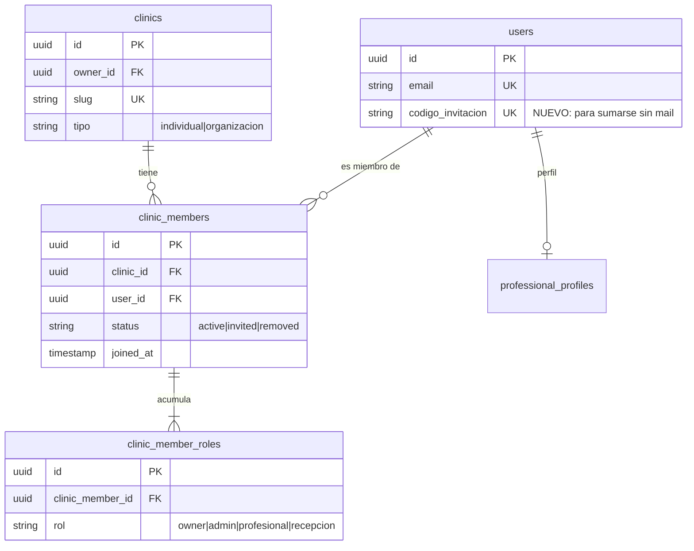
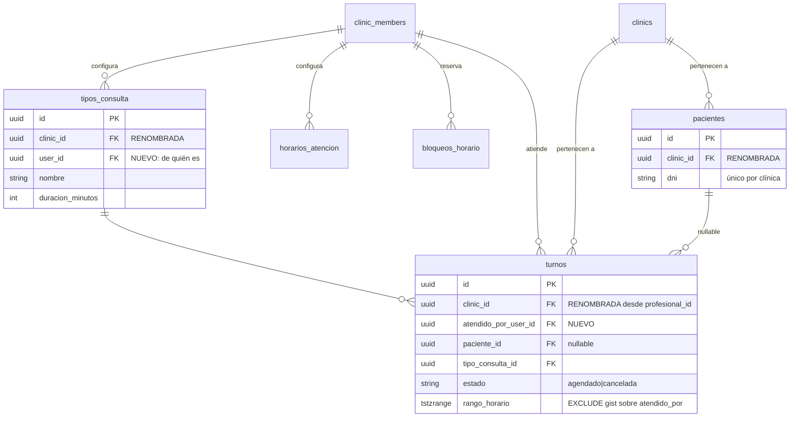

# Modelo de datos — DESPUÉS de la Fase 3

**Fecha:** 2026-09-13 · **Estado:** propuesta, sin implementar · **Punto de partida:** [`er-pre-fase3.md`](er-pre-fase3.md)

Entregable 1 del brief de Fase 3. Este documento es una **propuesta de diseño**: ninguna de estas tablas existe todavía. Se escribe antes del código a propósito — las decisiones de acá cuestan horas en un diagrama y días a mitad de la implementación.

---

## Las dos frases del brief que mandan sobre todo lo demás

> *"Los pacientes y los turnos viven dentro de la CLÍNICA, las VISTAS de los turnos y pacientes están ancladas al profesional que los gestiona."*

> *"Cada profesional tendrá SU CALENDARIO, con su configuración particular."*

De ahí sale el reparto completo, y no es intuitivo: **los datos del paciente son de la clínica, la configuración de la agenda es del profesional.** Un paciente atendido por dos odontólogos es *una* ficha, no dos; pero cada odontólogo tiene sus propios tipos de consulta y su propio horario.

| Tabla | Hoy cuelga de | Pasa a colgar de | Por qué |
|---|---|---|---|
| `pacientes` | clínica | **clínica** | Explícito en el brief. "Los pacientes de Lucía" se deriva de sus turnos |
| `turnos` | clínica | **clínica + profesional** | Vive en la clínica, lo gestiona un profesional |
| `tipos_consulta` | clínica | **profesional** | Cada uno configura los suyos; se comparten como sugerencia, no como dato común |
| `horarios_atencion` | clínica | **profesional** | "su configuración particular" |
| `bloqueos_horario` | clínica | **profesional** | Idem |
| `paginas_publicas` | clínica | **clínica** | La página es de la clínica, la administra el rol `admin` |
| `enlaces_turno` | clínica | **clínica + profesional opcional** | El brief permite "que elija el paciente" |
| conflictos y antiabuso | clínica | **clínica** | Son del tenant, no de una agenda |

---

## Diagrama entidad-relación

### El núcleo nuevo: persona, membresía y roles



**`clinic_members` ya existe y ya es N:M** — índice único sobre `(clinic_id, user_id)`, desde TR-044. No hay que inventar la relación: hay que empezar a usarla.

Los dos cambios reales son:

**1. Los roles se vuelven acumulables.** Hoy `role` es una columna única con check constraint. El brief pide tratarlos como tags: el titular es profesional **y** administrador de página a la vez, y `recepcion` es excluyente con los otros dos. Eso no cabe en una columna.

La exclusión mutua no queda en la aplicación, queda en el motor:

```sql
CREATE UNIQUE INDEX idx_rol_excluyente ON clinic_member_roles (clinic_member_id)
  WHERE rol IN ('profesional', 'recepcion');
```

Un índice único parcial: se puede tener `profesional` o `recepcion`, nunca los dos, y `admin`/`owner` se suman libremente. Mismo criterio que el no-solapamiento de turnos (spec §4.3) — la regla que no se puede violar vive en la base, no en una validación que alguien puede olvidar.

**Probado contra Postgres 16, no solo razonado.** Sobre una tabla temporal con ese índice: insertar `profesional` y después `admin` para el mismo miembro pasa; insertar `profesional` y después `recepcion` falla con `duplicate key value violates unique constraint`. La regla del brief queda expresada exactamente, sin código de aplicación.

**2. La membresía no se borra nunca, se marca `removed`.** Si se borrara, los turnos históricos del profesional que se fue quedarían colgando. Con `status` la clínica deja de darle acceso pero el historial sigue íntegro y auditable.

### Agenda — la configuración baja al profesional



---

## Las cuatro decisiones que hay que tomar ahora

### 1. El turno referencia al usuario, no a la membresía

`turnos.atendido_por_user_id` → `users.id`, **no** → `clinic_members.id`.

Un turno atendido hace seis meses es un hecho histórico. Atarlo a la membresía lo haría depender de que la relación laboral siga vigente, y cualquier limpieza de membresías se llevaría el historial puesto.

Pero la coherencia sí se garantiza en la base, con una **foreign key compuesta**:

```sql
ALTER TABLE turnos ADD CONSTRAINT fk_turnos_profesional_de_la_clinica
  FOREIGN KEY (clinic_id, atendido_por_user_id)
  REFERENCES clinic_members (clinic_id, user_id);
```

Es posible porque `idx_clinic_member` ya es un índice único sobre `(clinic_id, user_id)` — verificado en la base real, es el requisito que Postgres exige para aceptar una FK compuesta hacia esas columnas. Con esto, **el motor impide asignarle un turno a alguien que no es miembro de esa clínica** — no hay forma de hacerlo mal desde la aplicación, ni siquiera por error. Y es la razón por la que la membresía nunca se borra: si se borrara, esta FK bloquearía la baja de cualquier profesional con historial.

### 2. El no-solapamiento se muda, y de paso se vuelve más correcto

```sql
-- Antes: dos turnos de la misma CLÍNICA no pueden solaparse.
EXCLUDE USING gist (profesional_id WITH =, rango_horario WITH &&) WHERE (estado = 'agendado')

-- Después: dos turnos del mismo PROFESIONAL no pueden solaparse.
EXCLUDE USING gist (atendido_por_user_id WITH =, rango_horario WITH &&) WHERE (estado = 'agendado')
```

Sin este cambio, el requisito no negociable de la spec §4.3 se convierte en un **bloqueo falso**: dos odontólogos de la misma clínica atendiendo a las 10:00 en sillones distintos es lo normal, y el constraint viejo lo rechazaría.

Y hay un efecto secundario que conviene notar: como el nuevo constraint es por **usuario** y no lleva la clínica, impide también que un profesional tenga turnos solapados en **dos clínicas distintas** — que es exactamente lo correcto, porque una persona no puede estar en dos lugares a la vez. Es una garantía que el modelo viejo no podía ni expresar.

Requiere que `atendido_por_user_id` sea obligatorio en los turnos `agendado`, con un check análogo al de `hora_inicio`/`hora_fin`.

### 3. Renombrar `profesional_id` → `clinic_id` en las 9 tablas

Es la decisión más cara y la más fácil de postergar. **No hay que postergarla.**

Hoy el nombre es una molestia estética porque no existe ningún profesional distinto de la clínica. Desde la Fase 3 existe: `turnos` va a tener `profesional_id` (= la clínica) al lado de `atendido_por_user_id` (= el profesional). Dos columnas con nombres parecidos y significados opuestos, en la tabla más tocada del sistema.

Cualquiera que escriba `WHERE profesional_id = <el user del profesional>` va a obtener cero filas, sin error. Es el mismo tipo de bug silencioso que costó dos rondas enteras esta semana.

**Costo:** toca 9 tablas, sus 9 constraints, los modelos de GORM y todos los queries que las nombran. **Momento correcto:** ahora, en una migración sola, antes de que exista la columna que se le parece.

### 4. Los tipos de consulta se comparten como sugerencia, no como dato compartido

El brief pide que si un colega crea un tipo que vos no tenés, te aparezca como tag para incluirlo (con fuzzy matching sobre el nombre).

**Cada profesional tiene sus propias filas.** No hay tipos "de la clínica" que varios usen: `tipos_consulta` gana `user_id` y conserva `clinic_id` (para poder listar los del resto y ofrecerlos). Incluir el tipo de un colega **copia la fila**, no la comparte.

El motivo es que el tipo de consulta lleva duración, color, cantidad de sesiones y preferencia horaria — configuración que cada profesional ajusta a su manera. Compartir la fila haría que cambiar la duración de "Conducto" le modificara la agenda a otro.

---

## Lo que se elimina

Por el guardián de migraciones destructivas (TR-132), en el grupo **previo** al AutoMigrate:

| Tabla | Filas | Motivo |
|---|---|---|
| `profesionales` | **12** | Tabla del MVP original (profesional + clínica + password en una fila). Huérfanas desde TR-037: ningún id coincide con `users` ni `clinics`. La documentación la daba por vacía |
| `profesional_especialidades` | 0 | Depende de la anterior. Convive con `professional_especialidades`, que es la vigente |

---

## Resumen del cambio

| # | Cambio | Tipo |
|---|---|---|
| 1 | `clinic_member_roles` + índice único parcial de exclusión | Tabla nueva |
| 2 | `clinic_members.status` suma `removed` | Check |
| 3 | `users.codigo_invitacion` | Columna nueva |
| 4 | `turnos.atendido_por_user_id` + FK compuesta a la membresía | Columna + constraint |
| 5 | `tipos_consulta.user_id`, `horarios_atencion.user_id`, `bloqueos_horario.user_id` | Columnas nuevas |
| 6 | `sin_solapamiento_turno` se muda a `atendido_por_user_id` | Constraint |
| 7 | `profesional_id` → `clinic_id` en 9 tablas | Renombre |
| 8 | Baja de `profesionales` y `profesional_especialidades` | Destructiva (TR-132) |

**Orden obligatorio:** 7 antes que 4 (para no tener las dos columnas confusas conviviendo ni un minuto), y 5 antes que 6 (el constraint nuevo necesita la columna poblada). La migración de datos existentes —39 turnos, 7 tipos de consulta, 3 horarios— asigna todo al `owner` de cada clínica, que hoy es su único profesional.

## Lo que este modelo todavía no resuelve

- **Presencia en tiempo real** de colaboradores (requisito no funcional del brief). No es una tabla: es una decisión de transporte (WebSocket / SSE / polling) que conviene tomar aparte, y que interactúa con el hecho de que hoy corre **una sola instancia** del backend.
- **Reasignar un turno entre profesionales** (el brief se lo da al administrador). El modelo lo permite —cambiar `atendido_por_user_id`—, pero hay que decidir qué pasa con el `EXCLUDE` si el destino ya tiene ese horario ocupado, y si queda registro del cambio.
- **Qué ve un profesional de los pacientes de otro.** Los pacientes son de la clínica, así que el aislamiento de las *vistas* es una regla de la aplicación, no del esquema. Merece tests de aislamiento propios, como los que ya existen entre clínicas (TR-129).
