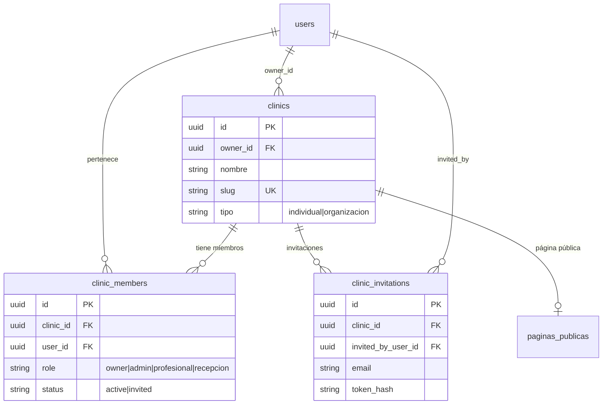
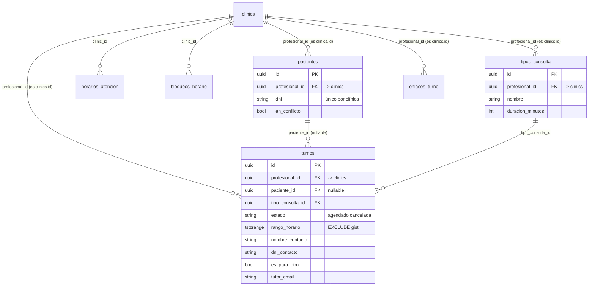
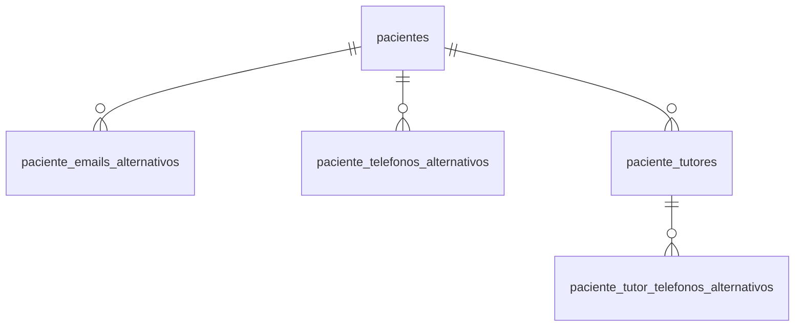
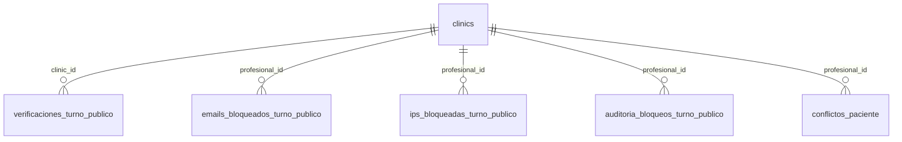

# Modelo de datos — ANTES de la Fase 3

**Fecha del relevamiento:** 2026-09-13 · **Fuente:** el esquema real de la base, no los modelos de Go — `pg_constraint`, `information_schema` y conteos de filas sobre la base de desarrollo.

Este es el punto de partida del multi-tenant. Su valor no es decorativo: **el 40% de las tablas cuelga de `clinics` por una columna que se llama `profesional_id`**, y entender esa deuda es lo que decide cuánto cuesta la Fase 3.

Entregable 1 del brief de Fase 3 (el "post" está en [`er-post-fase3.md`](er-post-fase3.md)).

---

## La trampa que hay que entender primero

```
pacientes.profesional_id  ──FK──>  clinics.id
turnos.profesional_id     ──FK──>  clinics.id
tipos_consulta.profesional_id ──FK──> clinics.id
```

La columna dice `profesional_id` y guarda un **`clinics.id`**. No es un error de lectura: es lo que verificó TR-131 al poner las foreign keys, y por eso las constraints se llaman por la relación real (`fk_pacientes_clinica`) y no por el nombre de la columna.

**Por qué pasó:** en el MVP, "profesional" y "clínica" eran la misma cosa — una fila en `profesionales` con `nombre`, `email`, `password_hash`, `nombre_clinica` y `slug` todo junto. Cuando TR-037 separó identidad (`users`) de negocio (`clinics`), el significado de la columna cambió pero el nombre quedó.

**Por qué importa ahora:** la Fase 3 introduce, por primera vez, un profesional que **no es** la clínica. A partir de ahí el nombre deja de ser una molestia estética y pasa a ser una trampa activa: `turnos.profesional_id` va a convivir con la columna que sí apunta al profesional que atiende.

### La otra herencia: `profesionales` no está vacía

CLAUDE.md y TR-131 afirman que la tabla legacy `profesionales` "está vacía". **Tiene 12 filas.** Ninguna corresponde a un `users.id` ni a un `clinics.id`: son registros del MVP original, huérfanos desde TR-037.

Solo la referencia `profesional_especialidades` (0 filas), que a su vez convive con `professional_especialidades` (0 filas) — dos tablas para lo mismo, una legacy y una actual, diferenciadas por una letra.

Candidatas a eliminarse en esta fase, por el guardián de migraciones destructivas (TR-132).

---

## Diagrama entidad-relación

Agrupado por dominio, porque 31 tablas en un solo diagrama no se leen. Las relaciones cruzadas entre dominios están anotadas.

### Identidad y cuentas

```mermaid
erDiagram
    users ||--o| professional_profiles : "perfil profesional"
    users ||--o{ accounts : "login social"
    users ||--o{ sessions : "sesiones activas"
    users ||--o{ verification_tokens : "verificación de mail"
    users ||--o{ audit_events : "auditoría"
    users ||--o{ professional_especialidades : "especialidades"
    especialidades ||--o{ professional_especialidades : ""

    users {
        uuid id PK
        string email UK
        string password_hash
        bool email_verified
    }
    professional_profiles {
        uuid user_id PK_FK
        string nombre
        string matricula
    }
    sessions {
        uuid id PK
        uuid user_id FK "CASCADE"
        string token_hash UK
    }
```

`sessions`, `accounts`, `verification_tokens`, `professional_profiles` y `professional_especialidades` borran en **CASCADE** con el usuario. `audit_events` queda con **SET NULL**: el registro de auditoría sobrevive a la baja de la cuenta, a propósito.

### Clínica y membresía — la parte que ya soporta multi-tenant



**Esto ya es N:M.** `clinic_members` tiene índice único sobre `(clinic_id, user_id)`, los cuatro roles que pide el brief y los dos estados que hacen falta para invitar. Existe desde TR-044 y nunca se usó: hoy hay 3 usuarios, 3 clínicas y 3 membresías — una por cabeza.

### Agenda — todo colgado de la clínica



**Acá está el corazón del cambio.** Hoy la agenda entera —tipos de consulta, horario de atención, horarios reservados, turnos— cuelga de la **clínica**. La Fase 3 necesita que la configuración cuelgue del **profesional**, y que el turno sepa quién lo atiende.

El constraint `EXCLUDE USING gist` sobre `(profesional_id, rango_horario)` es el requisito no negociable de la spec §4.3. Hoy impide que dos turnos de la misma **clínica** se solapen. Con N profesionales eso pasa de garantía a **bug**: dos odontólogos de la misma clínica atienden a la misma hora, en sillones distintos, y el constraint lo rechazaría.

### Ficha del paciente



Las tres tablas hijas tienen FK `NO ACTION`: borrar una ficha exige limpiarlas antes, y ese es el motivo de que `borrarFichaPacienteConSusHijas` sea el único lugar del código que borra un paciente (addendum de TR-131).

### Wizard público y antiabuso



`conflictos_paciente` **no tiene** foreign key a `pacientes` a propósito: es historial, y sus referencias quedan colgadas cuando se resuelve un conflicto. Hay un test que lo protege.

---

## Modelo relacional (resumen)

Las 33 foreign keys, por tabla referenciada:

| Referencia | Tablas que dependen | Semántica |
|---|---|---|
| `clinics` | 14: turnos, pacientes, tipos_consulta, horarios_atencion, bloqueos_horario, paginas_publicas, enlaces_turno, clinic_members, clinic_invitations, verificaciones_turno_publico, conflictos_paciente, y las 3 de antiabuso | `NO ACTION` |
| `users` | 9: accounts, sessions, verification_tokens, professional_profiles, professional_especialidades, clinic_members, clinic_invitations, clinics (owner), audit_events | `CASCADE` salvo `audit_events` (SET NULL) y `clinics.owner_id` (NO ACTION) |
| `pacientes` | 4: turnos, emails alt., teléfonos alt., tutores | `NO ACTION` |
| `especialidades` | 2 | `NO ACTION` |
| `tipos_consulta`, `paciente_tutores`, `professional_profiles`, `profesionales` (legacy) | 1 c/u | `NO ACTION` |

**De las 14 que cuelgan de `clinics`, 9 lo hacen por una columna llamada `profesional_id`** y 5 por `clinic_id`. Esa inconsistencia de nombres es la deuda que la Fase 3 vuelve peligrosa.

## Estado de los datos (desarrollo, 2026-09-13)

| Tabla | Filas | Nota |
|---|---|---|
| `users` / `clinics` / `clinic_members` | 3 / 3 / 3 | Una membresía por persona: el multi-tenant está en el esquema, sin usar |
| `professional_profiles` | 3 | |
| `turnos` | 39 | |
| `pacientes` | 9 | |
| `tipos_consulta` | 7 | Repartidos entre las 3 clínicas |
| `horarios_atencion` | 3 | |
| `paginas_publicas` | 2 | |
| **`profesionales` (legacy)** | **12** | Huérfanas: ningún id coincide con `users` ni `clinics` |
| `profesional_especialidades` (legacy) | 0 | Convive con `professional_especialidades`, también 0 |

## Lo que este relevamiento deja decidido para el "post"

1. **`clinic_members` no hay que inventarlo** — existe, es N:M y tiene los cuatro roles. Lo que falta es que los roles sean **acumulables**: el brief pide tratarlos como tags (el titular es profesional *y* administrador de página a la vez), y hoy `role` es una única columna con check constraint.
2. **La configuración de agenda tiene que mudarse de la clínica al profesional**: `tipos_consulta`, `horarios_atencion`, `bloqueos_horario`.
3. **`turnos` necesita saber quién atiende**, y eso convive con `profesional_id` (que apunta a la clínica). Dos columnas parecidas con significados distintos es una trampa garantizada si no se renombra.
4. **El `EXCLUDE USING gist` hay que rehacerlo** sobre el profesional que atiende, o deja de ser una garantía y pasa a ser un bloqueo falso.
5. **`pacientes` se queda en la clínica** (el brief es explícito), y "los pacientes de un profesional" se deriva de sus turnos, no de una columna.
6. **Hay basura para limpiar**: `profesionales` (12 filas huérfanas) y `profesional_especialidades`, por el guardián de TR-132.
